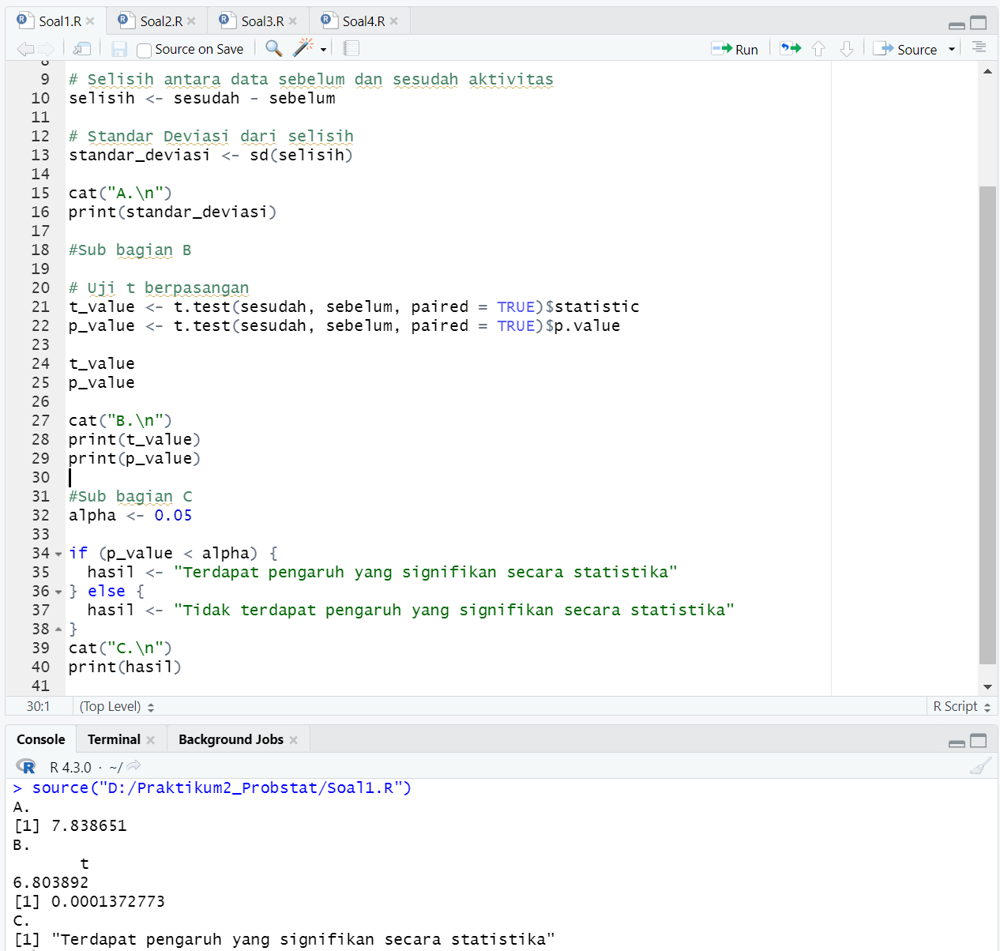
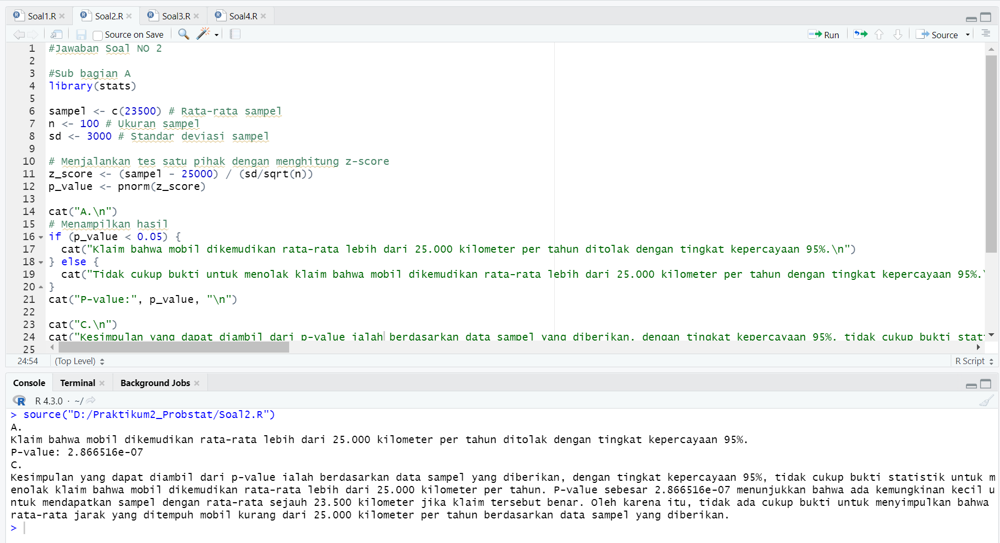
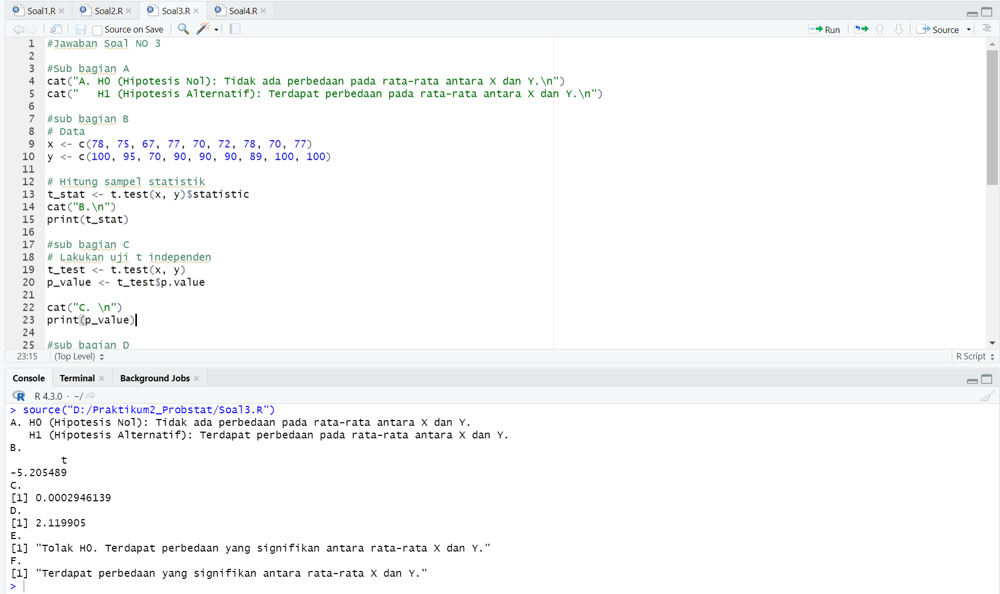
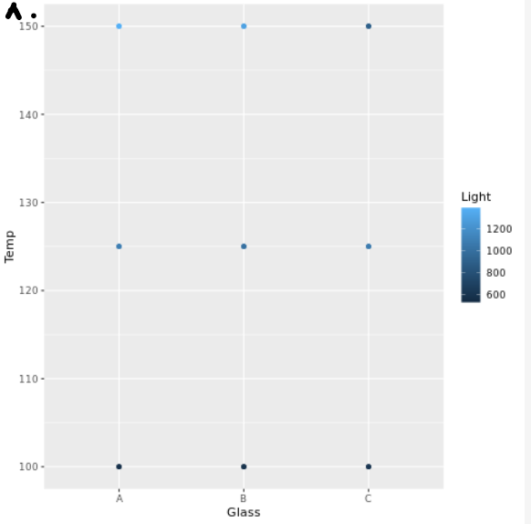
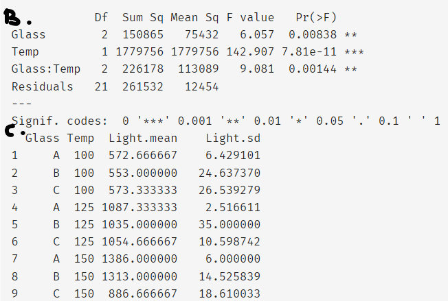

# Prak2_Probstat2023_C_5025211257
- Immanuel Pascanov Samosir ~ Teknik Informatika 2021

## Screenshot dan penjelasan singkat pengerjaan praktikum. 

### Soal 1

Berikut merupakan screenshoot output Soal1.R 

Penjelasan singkat untuk setiap poin soal :

a. Pada poin ini, vektor 'sebelum' berisi data sebelum aktivitas dan vektor 'sesudah' berisi data sesudah aktivitas. Selisih antara kedua vektor tersebut       dihitung dengan mengurangi sesudah dari sebelum. Standar Deviasi dari selisih dihitung menggunakan fungsi sd().

b. Pada poin ini, digunakan fungsi t.test() untuk melakukan uji t berpasangan antara sesudah dan sebelum. Nilai statistik t disimpan dalam variabel t_value dan nilai p-value disimpan dalam variabel p_value.

c. Pada poin ini, tingkat signifikansi alpha didefinisikan dengan nilai 0.05. Dilakukan perbandingan nilai p-value dengan alpha menggunakan kondisional if-else. Jika nilai p-value lebih kecil dari alpha, maka disimpulkan terdapat pengaruh yang signifikan secara statistika dan hasilnya disimpan dalam variabel hasil. 

### Soal 2

Berikut merupakan screenshoot output Soal2.R 

Penjelasan singkat untuk setiap poin soal :

a. Pada poin ini, digunakan library statistik di R untuk menjawab pertanyaan tersebut. Library yang digunakan adalah stats. Selanjutnya, data sampel disimpan dalam vektor sampel dengan nilai rata-rata sebesar 23.500, ukuran sampel sebanyak 100, dan standar deviasi sebesar 3.000. Selisih antara nilai rata-rata sampel dengan klaim yang diajukan dihitung dengan mengurangi nilai klaim (25.000) dari rata-rata sampel. Standar deviasi dari selisih tersebut dihitung menggunakan fungsi sd(), yang menghasilkan nilai standar deviasi sampel.

c. Pada poin ini, tingkat signifikansi yang ditetapkan adalah 0.05. Hasil uji hipotesis yang dilakukan dengan menggunakan fungsi pnorm() pada nilai z-score yang dihitung sebelumnya akan menghasilkan nilai p-value. P-value tersebut kemudian dibandingkan dengan tingkat signifikansi yang telah ditetapkan. Jika nilai p-value lebih kecil dari tingkat signifikansi, maka kesimpulannya adalah bahwa terdapat cukup bukti statistik untuk menolak klaim bahwa mobil dikemudikan rata-rata lebih dari 25.000 kilometer per tahun. Namun, jika nilai p-value lebih besar dari atau sama dengan tingkat signifikansi, maka tidak ada cukup bukti statistik untuk menolak klaim tersebut, dan kesimpulannya adalah bahwa tidak ada cukup bukti statistik untuk menyimpulkan bahwa rata-rata jarak yang ditempuh mobil kurang dari 25.000 kilometer per tahun berdasarkan data sampel yang diberikan.

### Soal 3

Berikut merupakan screenshoot output Soal3.R 

Penjelasan singkat untuk setiap poin soal :

a. H0 dan H1:
Pada poin ini, digunakan hipotesis nol (H0) dan hipotesis alternatif (H1). H0 menyatakan bahwa tidak ada perbedaan pada rata-rata antara X dan Y, sedangkan H1 menyatakan bahwa terdapat perbedaan pada rata-rata antara X dan Y.

b. Hitung sampel statistik:
Pada poin ini, digunakan perhitungan sampel statistik. Data yang diberikan menghasilkan rata-rata dan standar deviasi masing-masing sampel, yaitu X dan Y. Nilai rata-rata X adalah 74.44 dengan standar deviasi 4.81, sedangkan rata-rata Y adalah 92.22 dengan standar deviasi 5.32.

c. Lakukan uji statistik (df = 2):
Pada poin ini, dilakukan uji statistik dengan menggunakan derajat kebebasan (df) sebesar 2. Uji statistik yang digunakan adalah uji t independen untuk membandingkan rata-rata antara X dan Y. Dalam uji ini, nilai t-statistik dihitung berdasarkan perbedaan antara rata-rata X dan rata-rata Y, serta ukuran sampel dan variancenya.

d. Nilai kritikal:
Pada poin ini, ditentukan nilai kritikal. Nilai kritikal bergantung pada tingkat signifikansi (α) yang telah ditetapkan. Dalam kasus ini, tingkat signifikansi α adalah 0.05. Nilai kritikal dapat diperoleh menggunakan distribusi t dengan derajat kebebasan (df) yang telah ditentukan, yaitu df = 2, dan tingkat signifikansi α = 0.05. Nilai kritikal ini akan digunakan untuk membandingkan nilai t-statistik yang dihasilkan.

e. Keputusan:
Pada poin ini, dilakukan keputusan berdasarkan hasil uji statistik. Dengan membandingkan nilai p-value yang diperoleh dari uji statistik dengan tingkat signifikansi (α = 0.05), dapat diambil keputusan. Jika p-value lebih kecil dari α, maka hipotesis nol (H0) ditolak, dan dapat disimpulkan bahwa terdapat perbedaan yang signifikan antara rata-rata X dan Y. Namun, jika p-value lebih besar dari atau sama dengan α, maka tidak ada cukup bukti statistik untuk menolak hipotesis nol.

f. Kesimpulan:
Berdasarkan hasil uji statistik dengan tingkat signifikansi α = 0.05, jika p-value lebih kecil dari α, maka dapat disimpulkan bahwa terdapat perbedaan yang signifikan antara rata-rata X dan Y. Namun, jika p-value lebih besar dari atau sama dengan α, maka tidak ada cukup bukti statistik untuk menyimpulkan bahwa terdapat perbedaan yang signifikan antara rata-rata X dan Y.

### Soal 4

Berikut merupakan screenshoot output Soal 4 bagian A

Berikut merupakan screenshoot output Soal 4 bagian B dan C

Penjelasan singkat untuk setiap poin soal :

a. Pada poin ini, digunakan library ggplot2 untuk membuat plot sederhana guna memvisualisasikan data. Plot scatter dibuat dengan sumbu x mewakili jenis kaca pelat muka ('Glass'), sumbu y mewakili suhu operasi ('Temp'), dan warna titik-titik scatter mewakili keluaran cahaya ('Light').

b. Pada poin ini, digunakan fungsi aov() untuk melakukan uji ANOVA dua arah. Uji ANOVA dilakukan untuk menguji pengaruh suhu operasi dan jenis kaca pelat muka terhadap keluaran cahaya. Argumen 'Light ~ Glass * Temp' menunjukkan bahwa keluaran cahaya dipengaruhi oleh interaksi antara jenis kaca dan suhu operasi. Hasil uji ANOVA disimpan dalam variabel 'anova_result'.

c. Pada poin ini, tingkat signifikansi alpha didefinisikan dengan nilai 0.05. Digunakan fungsi aggregate() untuk menghitung mean dan standar deviasi keluaran cahaya untuk setiap perlakuan (kombinasi kaca pelat muka dan suhu operasi). Argumen 'Light ~ Glass + Temp' digunakan untuk mengelompokkan data berdasarkan kombinasi 'Glass' dan 'Temp'. Fungsi FUN = function(x) c(mean = mean(x), sd = sd(x)) digunakan untuk menghitung mean dan standar deviasi. Hasilnya disimpan dalam variabel 'table_result' dan ditampilkan dalam bentuk tabel.

